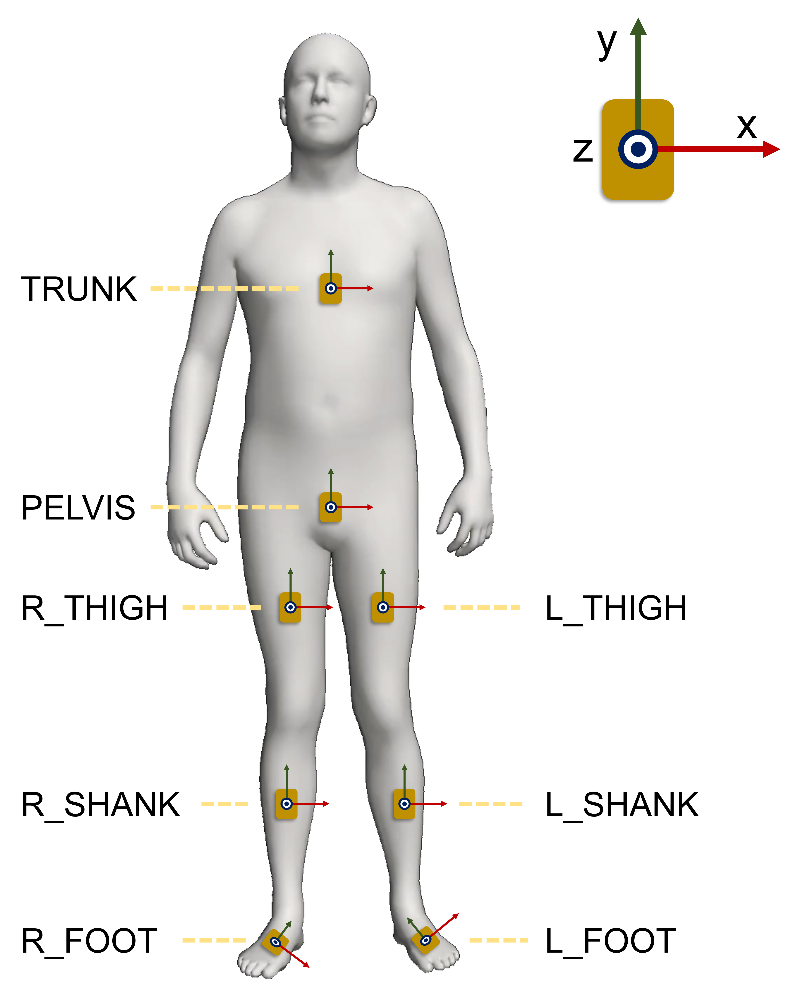

# Self-Supervised Learning for IMU-Driven Biomechanical Estimation
By Tian (Alan) Tan, Peter Shull, and Akshay Chaudhari

## Exclusive Summary
This repository includes the code and models for an abstract presented at ASB2023.
Full-length preprint is coming soon.

[//]: # (An [example implementation]&#40;#running-example-code&#41; is provided.)
[//]: # (When implementing our models, please place the IMUs according to [Hardware]&#40;#hardware&#41;)
[//]: # (and store the data according to [Data Format]&#40;#data-format&#41;.)

## How to Use
### Environment
Our code is developed under the following environment. Versions different from ours may still work.

Python 3.8; Pytorch 1.7.0; Cuda 11.0; Cudnn 8.0.4; matplotlib 3.3.2; numpy 1.19.4; h5py 3.0.0; Scikit-learn 0.23.2

### Example code
[An example script](./example_usage/run_example.py)
that loads one [example dataset](./example_usage/Camargo_levelground.h5) [3],
fine-tunes the pre-trained [transformer model](./example_usage/pretrained_model_weights.pth)., and
evaluates the fine-tuned model on the test set.

### IMUs
One to eight IMUs should be placed on the body as shown in the figure below.
When using less than eight IMUs, specify the IMU indices in the `--imu_idx` argument.
Each IMU's z-axis is aligned with the body segment surface normal, y-axis points upwards,
and x-axis being perpendicular to the y and z axes following the right-hand rule.

## SSL datasets
[AMASS](https://amass.is.tue.mpg.de/download.php)
[1]

[MoVi](https://www.biomotionlab.ca/movi/) 
[2]

## Downstream datasets
[Downstream dataset 1](https://www.epic.gatech.edu/opensource-biomechanics-camargo-et-al/)
[3]

[Downstream dataset 2](https://simtk.org/projects/imukinetics)
[4]

Downstream dataset 3 [5]

## References
[1] Mahmood, Naureen, et al. "AMASS: Archive of motion capture as surface shapes."
*Proceedings of the IEEE/CVF international conference on computer vision*. 2019.

[2] Ghorbani, Saeed, et al. "MoVi: A large multi-purpose human motion and video dataset."
*Plos One* 16.6 (2021): e0253157.

[3] Camargo, Jonathan, et al. "A comprehensive, open-source dataset of lower limb biomechanics
in multiple conditions of stairs, ramps, and level-ground ambulation and transitions."
*Journal of Biomechanics* 119 (2021): 110320.

[4] Tan, Tian, et al. "IMU and smartphone camera fusion for knee adduction and knee flexion
moment estimation during walking." *IEEE Transactions on Industrial Informatics* 19.2 (2022): 1445-1455.

[5] Sun, Tao, et al. "Real-time ground reaction force and knee extension moment estimation
during drop landings via modular LSTM modeling and wearable IMUs."
*IEEE Journal of Biomedical and Health Informatics* (2023).

